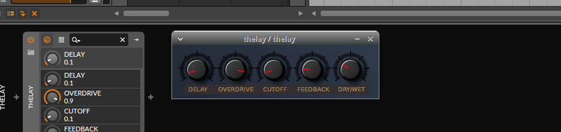

# VST2 ABI example with editor, for Windows and Linux
This is the smallest amount of code, for making a cross platform VST2 audio plugin with a graphical editor yet. It give you a framwork for changing and adding your code.
The code crosscompiles with 100% identical code to Windows and Linux.

This code was written on Linux and cross compiles to Windows, or can be compiled on Windows with MinGW. It subrogates the VST2 license by only using the VST2 ABI and makes it possible to make VST2 plugs without any third party licences. This makes it possible for anyone to make VST2 ABI compatible audio plugins, that will be fully useful in numerous music programs on Windows and Linux.

This present a strait forward way, to make a new plug even for beginners and gain deep knowleage in the plugin format. With almost everything needed for a new plug in one small and simple well documented file, with about 90 lines of code. Perfect for future tutorials.
The code is written entirely in C code, a language that is commonly used for audio applications for hardware, and it's a much simpler language than C++ to learn.

## Making your own plug
I would check out the plug_specific_code.c file. There you will find everything to make your own plug, by tweeking that file. There you will find about 90 lines of custom code for a delay plug. Compile the project, and then make changes in that file and check out the changes in a music program.

## Subrogating the VST2 licence - Making VST2 development availabe for anyone
To make this available and useful for anyone, this code-base only makes use of parts of the VST2 ABI.

I could have kept the original API for VST2 plugins, but settled to use a fully compatible route only using the ABI.

It's proven in court that you can't protect a API from common usage according to the the U.S. Supreme Court’s April 5 ruling in Google LLC v. Oracle America Inc. in 2021. And it's certainly the case that you can't protect an ABI with copyright within all reasonable doubt. Therefore this code can be used without any concerns of any third party licenses, as it only make use of the ABI, and any resemblance of the original API could be well motivated as it's not even prohibited to make use of the original API without any violation of any original licenses.

This example, makes it possible for anyone to make an audio plugin in C code with a graphical editor. This makes compiled binaries usable in the most amount of music programs, with the least amount of code and dependencies. This makes it easy to support anything that has VST2 plugin capability. It currently only supports 64-bit platforms. But I'm looking for a way to support 32-bit systems also with only one line of code, as I think 2 or 3 lines for that is too much.

I have kept the code size as low as possible, and made it compatible with Linux and Windows without any third party libraries, relying only on well established standards. This will make it compatible to the most systems even when compiling on a Linux machine and compile to Windows. And you can event test out your Windows plugs running Wine on Linux without any type of tweaking.

For the graphics part, it makes use of a RAW display buffer for graphics. And I have made a simple library that makes GUI's for audio plugins possible with the least amount of code and dependencies.

## Ikigui - The graphics library used
A new cross platform audio plugin GUI library for tiled graphics and animations. That uses almost no code at all, and is very easy to use.
The name is a wordplay with the Japanese words 'iki' and 'ikigai', combined with GUI (Graphical User Interface).  

For displaying graphics it uses character maps and bitmap graphics, an old concept widely used in the 80's and in 2D computer games. But in this case you can place them anywhere in the editor window.
Character maps is a very powerful concept, that gives very little code, for doing wonderous stuff. It can be used for animations, text and other stuff very easily and fits the needs for graphics in audio plugins very well.

This graphics library was originally made for making classic programming following the style of programming form the 80's. And it's tweaked to be even more flexible and easy to use than it's ever has been. All code made for making standalone applications is stripped form the library at this moment. The code for making this was originally made for SDL2, but as this lacks compatibility for child window events that is necessary for audio plugins, I made my own compatibility layer that replaces SDL2.
The platform specific code gets selected automatically, depending on what platform the compiler uses.

The core concept here is simplicity, and less is more. There is not much to learn, and it gives fewer compatibility issues.

## Tutorials
A tutorial on how to use and change this example will luckely be provided later on. This is only a showcase at the moment, even if it's fully working code.
## Compilation on Linux
It can easily be done on a standard Linux machine with a command like...
```
gcc generic_fx_code.c -o plugin.so -fPIC -shared
```
...for a 64-bit Linux plugin. Or...
```
x86_64-w64-mingw32-gcc generic_fx_code.c -o plugin.dll -fPIC -shared -lgdi32
```
...for a 64-bit Windows plugin.
## GCC and MinGW for compilation on Windows
MinGW-w64 can be used to compile the code on Windows. I would recommend downloading [TDM-GCC](https://jmeubank.github.io/tdm-gcc/articles/2021-05/10.3.0-release) and downloading the installer named tdm64-gcc-10.3.0-2.exe Then after that you should be able to compile from the CMD command prompt. You can compile with the example with a command like...
```
gcc generic_fx_code.c -o plugin.dll -fPIC -shared -lGDI32
```
...to make it generate the plugin .dll for you. There is also many other ways to install MinGW-w64 for making 64bit plugs. If you want a cross platform IDE for developing you can mabe try out [CodeLite](https://codelite.org/) or [Code::Blocks](https://www.codeblocks.org/) or [EclipseIDE](https://eclipseide.org/)
or use a simple editor that can run commands as you don't need any build scripts to compile this.
## Licences
The code will soon be dual-licensed for a small fee for closed source projects. More info later.
